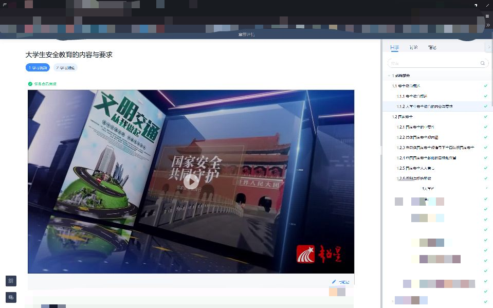
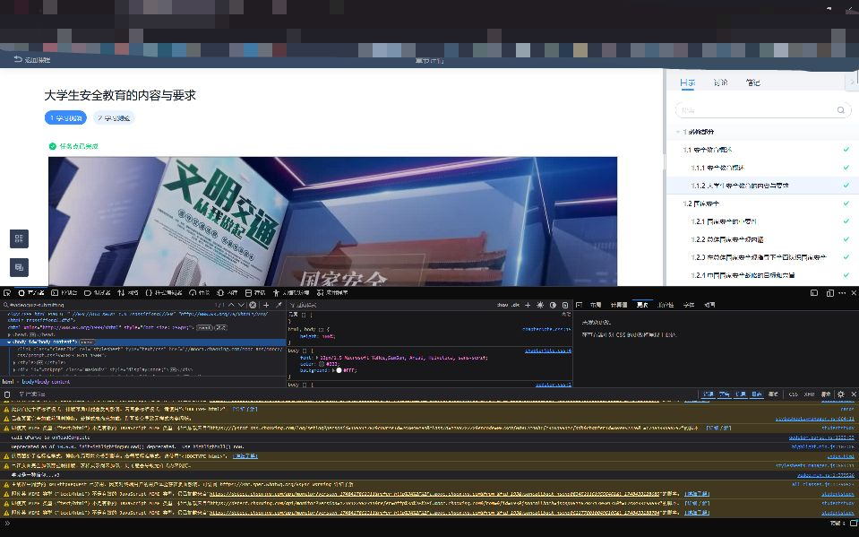
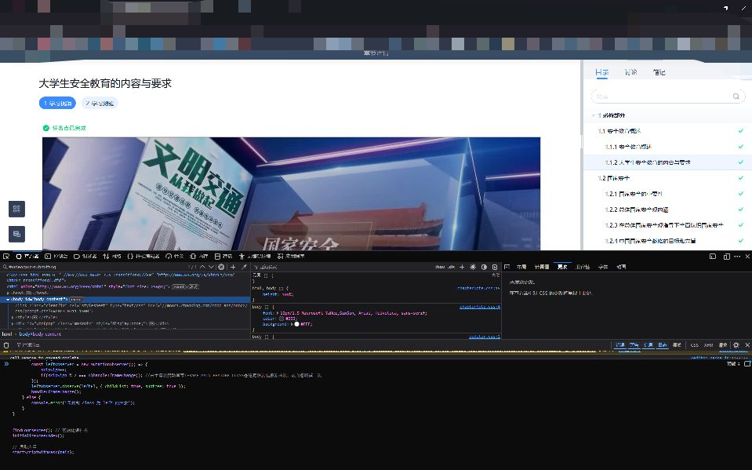
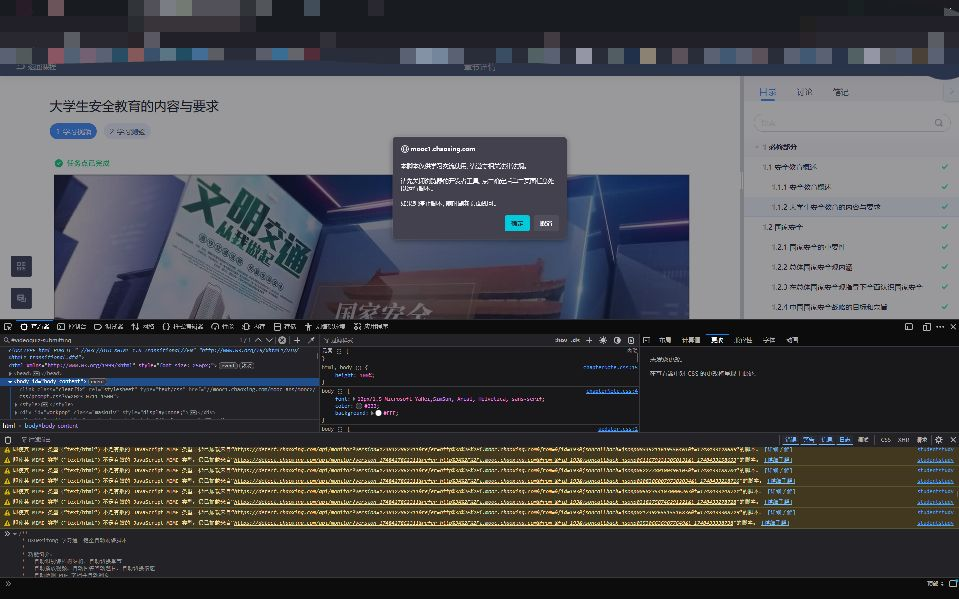

# uXuexitong 学习通一键全自动刷课脚本

## 脚本简介

> 该脚本灵感来自 [@chaolucky](https://github.com/chaolucky18/xuexitongScript) 大佬的项目。
> 本来只是想加一个检测互动答题的模块交个 PR，但发现原脚本的换课部分好像也过时了，于是就干脆完全重写了。
> 用法与 lucky 佬的基本一致，截止 2025/5/28 可用。

## 脚本功能

- 自动识别学习通课程树结构，自动切换到仍有任务点的章节
- 自动播放视频、自动回答互动题目、自动切换倍速
- 自动检测 PDF 文档并自动翻页
- 支持后台播放，操作简单快捷，节约您宝贵的时间

## 使用步骤

和lucky佬的基本一致，如下：

1.在学习通网页版进入想要刷的课程的播放页面

2.按下F12打开开发者工具

3.将main.js的内容复制粘贴到控制台（FireFox为查看器）

4.enter后按照说明操作即可（Edge可能复制的时候要求先打一个“允许粘贴”）

## 使用说明

1. 启动脚本后，需手动点击页面以激活脚本。
2. 如需停止，刷新页面即可。
3. 请勿用于商业用途或违反相关法律法规。

## 许可协议

本项目采用 CC BY-NC 4.0 协议，禁止任何商业用途。

## 注意事项

- 目前单一章节只识别第一个视频/PDF元素，可能会漏刷
- 仅支持学习通网页版，目前仅在 FireFox 验证，理论上不同浏览器均兼容（IE除外）
- 对于非视频/PDF类型的课程，脚本会尝试直接跳过
- 欢迎 Issue 反馈 bug 或建议，但请一定一定给出详细信息

## 未来计划

- 优化代码结构
- 支持自动静音
- 支持自动刷课后题目（前端能查答案的）
- 支持单一章节的多个视频/文件
- 支持更多课程类型
- 自动切换公网线路
- 增加容错处理/bug修复

## 题外话

本人的第一个JS项目，也是第一个前端脚本，本来以为工作量主要在实现逻辑上，结果有一半时间是花在处理异步错乱了（笑），只能说还是没经验，不过到底还是有惊无险地完成了，可喜可贺。

未来如果不被ban或者前端框架大改的话应该会长期更新

如果觉得有用，不妨star一下？会持续产出 ⌯>ᴗo⌯ಣ

**作者：unraous**

**邮箱：unraous@qq.com**

**日期：2025-05-28**

**版本：v1.0.0**
