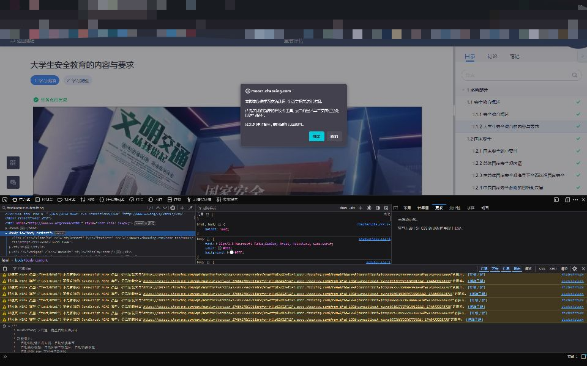

# uXuexitong 学习通一键全自动刷课脚本（支持 AI 自动答题）

## 项目简介

本项目灵感来自 [@chaolucky18](https://github.com/chaolucky18) 的 [xuexitongScript](https://github.com/chaolucky18/xuexitongScript)。在原有基础上重写，支持自动刷课、自动答题、AI 智能答题等功能，适配新版学习通网页版。

（如果觉得有用，欢迎 star 支持！✨）

## 功能特性

- 自动识别课程树结构，自动切换未完成章节
- 自动播放视频、自动切换倍速、自动静音
- 自动检测并翻页 PDF 文档
- 自动识别并答题（支持单选、多选、判断题）
- 支持 AI 自动答题（需配置 API Key）
- 支持后台播放，节省时间
- 兼容 FireFox、Edge 等主流浏览器

---

## 注意事项

- ai答题需要自己配置openai_api，推荐使用[kimi_api](https://platform.moonshot.cn), 快捷方便且免费。
- 打包版本请一定先保存你的api_key再使用，不然答题模块会出故障。
- 请将浏览器的默认语言更改为中文，防止一些未知的兼容性问题
- 依赖详见 [`requirements.txt`](requirements.txt)

## 环境依赖

- Python 3.12（推荐）
- 依赖详见 [`requirements.txt`](requirements.txt)

---

## 快速开始

直接进入release界面下载，打开配置好openai相关api后直接按照程序右侧提示操作即可

## 命令行运行

### 方式一：仅刷课（无答题）

和lucky佬的基本一致，如下： （目前有两种启动方式，以下为不包含回答课后习题的版本）

1.在学习通网页版进入想要刷的课程的播放页面


2.按下F12打开开发者工具


3.将main.js的内容复制粘贴到控制台（FireFox为查看器）


4.enter后按照说明操作即可（Edge可能复制的时候要求先打一个“允许粘贴”）



---

### 方式二：AI 自动答题（推荐）

1. **创建虚拟环境**

   ```sh
   python -m venv venv
   ```
2. **激活虚拟环境**

   - Windows:
     ```sh
     venv\Scripts\activate
     ```
   - macOS/Linux:
     ```sh
     source venv/bin/activate
     ```
3. **安装依赖**

   ```sh
   pip install -r requirements.txt
   ```
4. **配置 API Key**

   - 打开 [`src/py/config.py`](src/py/config.py) 或 `.env`，填写你的 AI 平台 key（如 [Moonshot](https://platform.moonshot.cn) 或 [OpenRouter](https://openrouter.ai/)）。
5. **启动后端服务，并按照终端提示运行**

   ```sh
   python src/py/main.py
   ```

---


## 贡献指南

欢迎提交 Issue、PR 或建议！请阅读 [`CONTRIBUTING.md`](CONTRIBUTING.md) 了解详细贡献流程和代码规范。

---

## 安全与许可

- 本项目仅供学习交流，禁止任何商业用途，遵循 [CC BY-NC 4.0](https://creativecommons.org/licenses/by-nc/4.0/) 协议
- 安全问题请参考 [`SECURITY.md`](SECURITY.md)

---

## 联系方式

- 作者：unraous
- 邮箱：unraous@qq.com

---

## 版本历史

- 2025-06-08 v1.2.0
- 2025-06-01 v1.1.0
- 2025-05-28 v1.0.0

---

## TODO

- 优化代码结构
- 支持更多课程类型
- 增加容错处理与 bug 修复
- 自动切换公网线路
