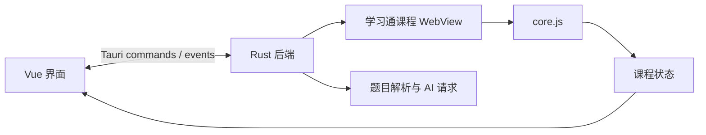

# 架构概览

uXueScript 由 Vue 前端、Tauri/Rust 后端和课程 WebView 组成。课程自动化逻辑保留为独立的 `core.js` 文件，可由桌面端注入，也可直接复制到浏览器控制台执行。

## 前端

`src` 包含 Vue 页面、布局、组件和由 Tauri Specta 生成的命令绑定。Configuration 管理模型和课程选项；课程仪表盘订阅后端状态事件；顶部控制栏负责课程 WebView 的导航和缩放。

## 后端与 WebView

`src-tauri/src` 负责窗口、配置、命令和自动化逻辑。课程 WebView 访问学习通页面；后端在页面加载完成后按 URL 类型注入 `core.js`、课程信息读取脚本或登录辅助脚本。

## 独立脚本

`src-tauri/src/scripts/core.js` 是自包含交付文件，不依赖 ES module 导入，以保留直接复制到浏览器控制台执行的能力。无后端使用方式见[无后端模式](../backend-free.md)。

## 测验与模型

`src-tauri/src/core/quiz` 负责 HTML 提取、加密字体映射和模型请求。该模块依赖桌面端后端，不属于独立脚本模式。
