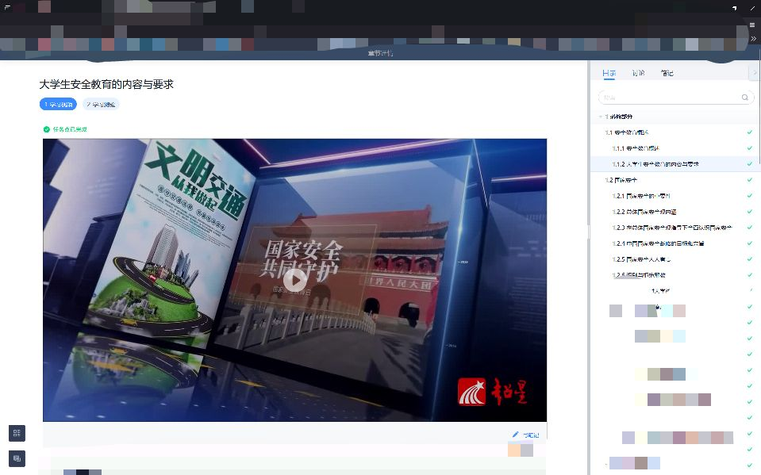
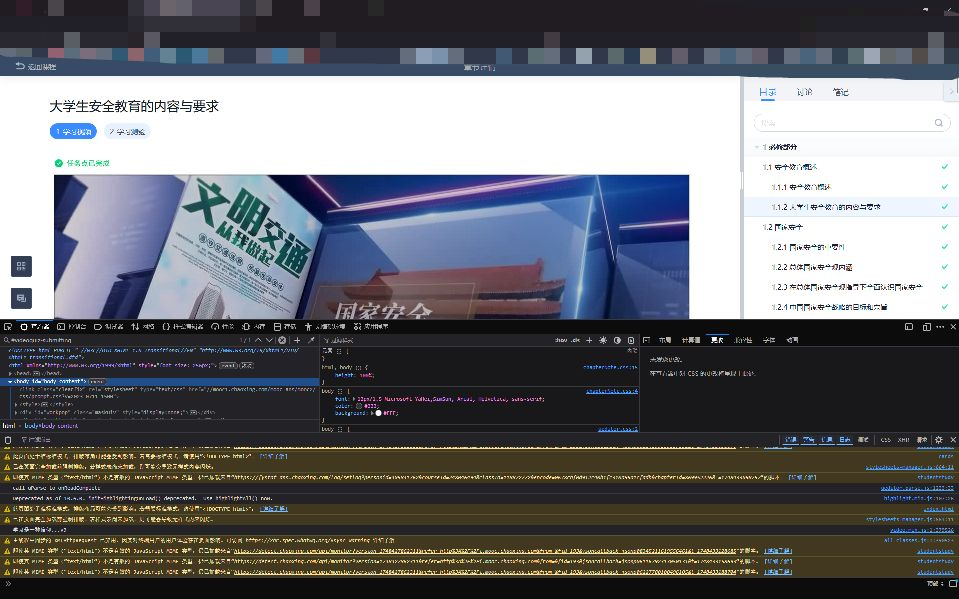
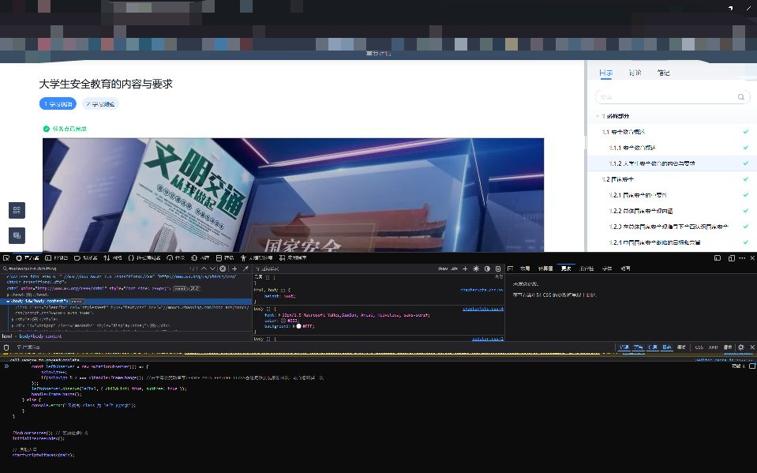
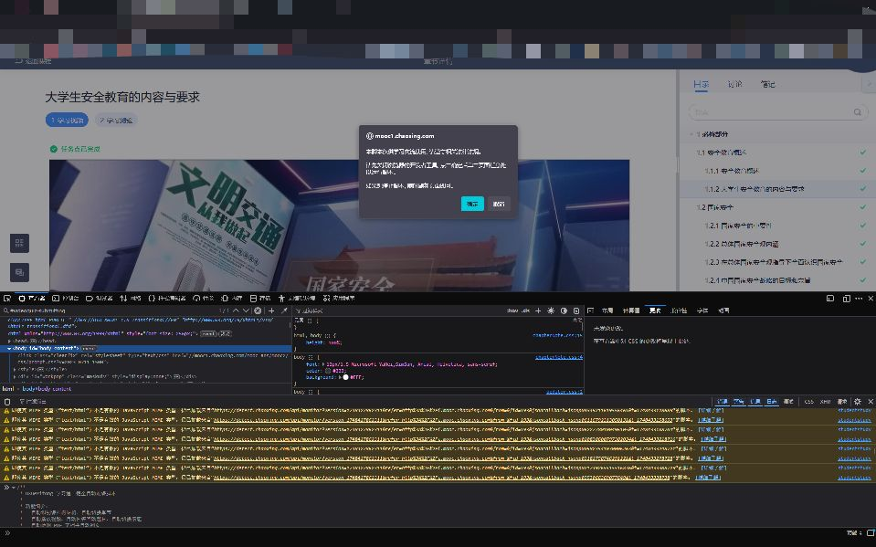

# 无后端模式：在浏览器控制台执行脚本

无需使用桌面端时，可将单文件脚本直接复制到学习通网页的浏览器控制台执行。该模式不启动 Tauri 后端，也不需要配置 API Key；仅支持脚本已实现的课程任务，不提供智能答题。

脚本源文件位于 [`src-tauri/src/scripts/core.js`](../src-tauri/src/scripts/core.js)。该文件可独立执行，复制全部内容即可。

## 操作步骤

1. 登录学习通网页版，进入需要处理的课程播放页面。

   

2. 按 <kbd>F12</kbd> 打开浏览器开发者工具，切换到 **Console（控制台）**。

   

3. 打开 `src-tauri/src/scripts/core.js`，复制全部内容并粘贴到控制台。旧版截图中的 `main.js` 为旧文件名；当前版本应复制 `core.js`。

   

4. 按 <kbd>Enter</kbd> 执行脚本，随后按页面提示启动任务。

   

## 常见问题

- Edge 等浏览器可能阻止直接粘贴脚本。按控制台提示完成允许粘贴操作后，再粘贴脚本。
- 请将浏览器界面语言设为中文。课程页面结构或语言差异可能影响脚本识别。
- 页面布局或课程类型发生变化时，脚本可能无法识别任务；请更新至最新版后再反馈问题。
